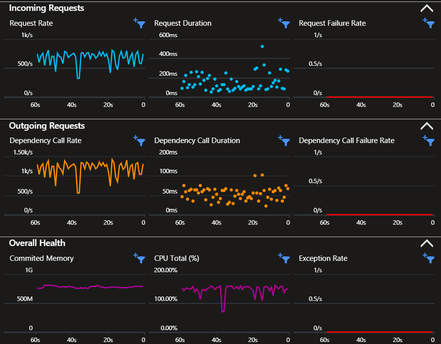

# Django Metrics with Azure Application Insights

Django REST API sending telemetry to Azure Application Insights from reference [sample][3].

Implement [Cloud_RoleName][2] tags for microservices.

> Live metrics is not supported at this time



Install the dependencies:

```sh
poetry install
poetry shell
```

Make sure to upgrade Bicep:

```sh
az bicep upgrade
```

Create the Azure Resources:

```sh
az deployment sub create \
    --location brazilsouth \
    --template-file azure/main.bicep \
    --parameters rgLocation=brazilsouth
```

To get the Application Insights connection string:

```sh
az monitor app-insights component show --app 'appi-myapp' -g 'rg-myapp' --query 'connectionString' -o tsv
```

Set the `APPLICATIONINSIGHTS_CONNECTION_STRING` environment variable:

```sh
cp samples/sample.env .env
```

Apply the migrations and start the server to start sending telemetry.

```sh
python manage.py migrate
python manage.py runserver --noreload
```

Additional examples [here][4] and [here][5].

[1]: https://learn.microsoft.com/en-us/azure/azure-monitor/app/separate-resources
[2]: https://learn.microsoft.com/en-us/azure/azure-monitor/app/app-map?tabs=python#set-or-override-cloud-role-name
[3]: https://github.com/Azure/azure-sdk-for-python/blob/main/sdk/monitor/azure-monitor-opentelemetry-exporter/samples/traces/django/sample/manage.py
[4]: https://github.com/open-telemetry/opentelemetry-python-contrib/tree/main/instrumentation/opentelemetry-instrumentation-django
[5]: https://learn.microsoft.com/en-us/python/api/overview/azure/monitor-opentelemetry-readme?view=azure-python